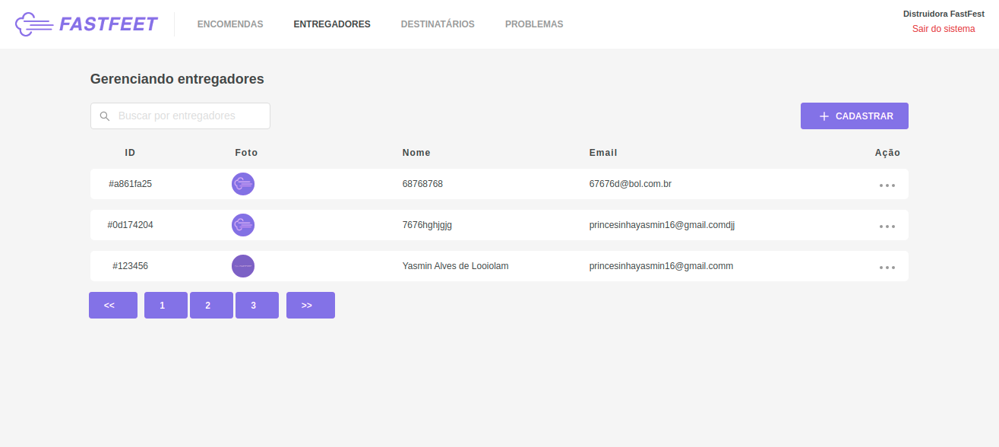
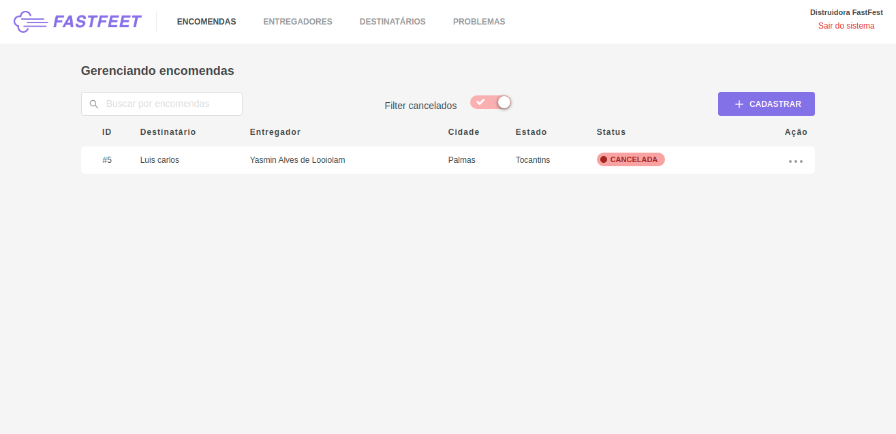

## Description

Aplicações desenvolvidas no sistema operacional Ubuntu 18.04.4 LTS 64 bits. Logo, o mobile não foi testado no Sistema IOS, somente no Android.

Projeto FastFeet, desenvolvido para o gerenciamento de entrega de encomendas, aplicações BACKEND, FRONTEND e MOBILE. Considerando que, quem acessa o sistema, recebe encomenda e entrega encomendas são pessoas, foi estruturado o banco de dados para que o email seja único para cada pessoa. Uma pessoa pode ter vários fones e pode definir o principal, assim como o endereço. Porém essas features seram desenvolvida no futuro.
Visto que algumas vezes tem-se a necessidade de adicionar algumas informações extras, foi criado o campo de observação no cadastro de encomenda. Também, houve a necessidade de criar o fone para o entregado e cliente, para que se tenha mais de uma forma de entrar em contato.   

No Mobile foi colocado a opção de aceitar os termos de uso para que o app possa ser utilizado, caso usuário não aceite não será possível usar o aplicativo.

O Frontend que é o sistema web foi criado paginações com navegação e na parte de entregas foi desenvolvido o filtro por encomendas canceladas.  Também, o sistema é responsivo para diversos tamanhos de telas.  





## Install yarn

> Install yarn on your system: [https://yarnpkg.com/en/docs/install](https://yarnpkg.com/en/docs/install)


## Install o NodeJS

```sh
$ curl -sL https://deb.nodesource.com/setup_12.x | sudo -E bash -
$ sudo apt-get install -y nodejs  
```
> Install docker on your system: [https://docs.docker.com/engine/install/](https://docs.docker.com/engine/install/)


### `Install postgres`
```sh
$ docker run --name database -e POSTGRES_PASSWORD=123456 -p 5432:5432 --restart always -d postgres
```
> Config database postgres
```sh
### `Criando a base de dados`
$ docker exec -i -t database /bin/sh
$ su postgres
$ psql
$ \dt
$ CREATE DATABASE fastfeet;
$ CREATE USER useradmin WITH ENCRYPTED PASSWORD 'password';
$ GRANT ALL PRIVILEGES ON DATABASE fastfeet TO useradmin;
$ \q
$ exit
$ exit
```

### `Install mongodb`
```sh 
$ docker run --name mongo -p 27017:27017 --restart always -d mongo
```
### `Install redis`

```sh
$ docker run -d \
  -h redis \
  -e REDIS_PASSWORD=password \
  -v redis-data:/data \
  -p 6379:6379 \
  --name redis \
  --restart always \
  redis:alpine /bin/sh -c 'redis-server --appendonly yes --requirepass ${REDIS_PASSWORD}' 
```

### `Clone`

```sh
$ git clone https://github.com/Djamilson/fastfeet.git
$ cd fastfeet
```
### `Backend`

```sh
$ cd fastfeet/backend
$ yarn install
$ yarn sequelize db:migrate
$ yarn sequelize db:seed:all
$ yarn dev
```

### `Config backend`

Copie e cole o arquivo .env_exemple e renomei para .env e configure todas as variáveis

> S3 e envio de email 
Para o envio de email foi utilizado o serviço da AWS SES - Amazon Simple Email Service - Amazon Web: [https://aws.amazon.com/pt/ses/](https://aws.amazon.com/pt/ses/).
É necessário a configuração para obter sucesso no recebimento das mensagens de cadastro e cancelamento de encomendas;

Também foi utilizado – Amazon Simple Storage Service (S3 ...
[https://aws.amazon.com/pt/ses/](https://aws.amazon.com/pt/ses/), para que o projeto fique mais escalável.

Todas essas variáveis devem ser configuradas no arquivo .env;

### `Projecto WEB`

```sh
$ cd fastfeet/frontend
$ yarn install
$ yarn start
```
> Config frontend

Dentro da pasta src/_config deve-se editar o arquivo host.js e colocar o IP do servidor/backend.

### `Projecto Mobile`

```sh
$ cd fastfeet/mobile
$ yarn install
$ yarn react-native run-android
$ yarn react-native start
```

